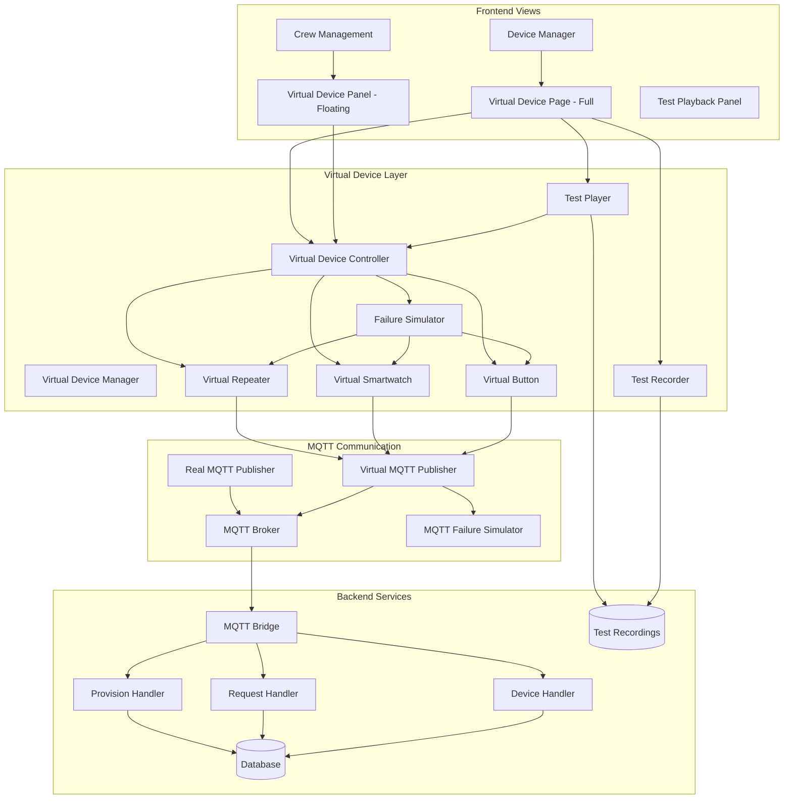

# Virtual MQTT Device Simulation System - Implementation Plan

## Overview

This document outlines the implementation plan for a comprehensive virtual device simulation system that closely mimics real ESP32 devices while providing advanced testing capabilities. Virtual devices will communicate through the actual MQTT broker, making them functionally identical to real devices except for clear visual indicators.

## System Architecture



## Core Features

### 1. Full MQTT Protocol Compliance
- Virtual devices publish to the same MQTT topics as real devices
- Follow exact message formats and protocols
- Support all device types: buttons, smartwatches, repeaters
- Seamless integration with existing handlers

### 2. Realistic Behavior Simulation
- Battery drain simulation (gradual and instant)
- Signal strength fluctuation
- Location tracking for smartwatches
- Automatic request acceptance based on crew availability
- Device lifecycle simulation

### 3. Advanced Testing Capabilities

#### Failure Simulation
- Device offline/online states
- Battery critical conditions
- Signal loss and poor connectivity
- Intermittent connections
- Hardware failure simulation
- Network issues (packet loss, latency)

#### Recording & Playback
- Record all device events and interactions
- Save recordings with metadata
- Playback at variable speeds
- Loop recordings for stress testing
- Device mapping for different environments

### 4. Dual UI Implementation

#### Floating Widget
- Draggable and resizable
- Quick access during development
- Minimized/expanded modes
- Direct link to full page

#### Full Page View
- Comprehensive device management
- Test scenario execution
- Recording management
- Detailed device controls

### 5. Visual Distinction
- Yellow badges/borders for virtual devices
- "VIRTUAL MODE" indicators
- Clear status displays
- Separate sections in UI

## Implementation Components

### Backend Components

#### 1. Virtual Device Base Class
```typescript
interface VirtualDeviceConfig {
  uid?: string;
  name: string;
  room: string;
  type: 'BUTTON' | 'SMART_WATCH' | 'REPEATER';
  initialBattery?: number;
  initialSignal?: number;
  isVirtual: boolean;
  failureMode?: 'none' | 'offline' | 'low_battery' | 'poor_signal' | 'intermittent';
}
```

#### 2. Virtual Smart Button
- Simulates button presses (short/long)
- Voice message simulation
- Emergency button functionality
- Battery drain on use

#### 3. Virtual Smartwatch
- Crew assignment
- Location tracking
- Status updates
- Request handling
- Shift management

#### 4. Failure Simulator
- Multiple failure modes
- Configurable parameters
- Real-time failure injection
- Recovery simulation

#### 5. Test Recorder/Player
- Event capture system
- Timestamp-based playback
- Speed control
- Loop functionality

### Frontend Components

#### 1. Virtual Device Control Panel
- Device creation interface
- Real-time status display
- Action buttons
- Failure mode controls

#### 2. Test Scenario Manager
- Pre-built scenarios
- Custom scenario builder
- Execution controls
- Progress monitoring

#### 3. Recording Manager
- Recording list
- Playback controls
- Export/import functionality
- Recording metadata

### API Endpoints

#### Device Management
- `POST /api/virtual-devices` - Create virtual device
- `GET /api/virtual-devices` - List virtual devices
- `PUT /api/virtual-devices/:id` - Update device
- `DELETE /api/virtual-devices/:id` - Remove device
- `POST /api/virtual-devices/:id/action` - Trigger device action

#### Test Management
- `POST /api/test-recordings` - Save recording
- `GET /api/test-recordings` - List recordings
- `GET /api/test-recordings/:id` - Get recording
- `POST /api/test-scenarios/execute` - Run scenario

## Database Schema Updates

```sql
-- Add virtual device support
ALTER TABLE Device ADD COLUMN isVirtual BOOLEAN DEFAULT false;
ALTER TABLE Device ADD COLUMN virtualConfig JSONB;

-- Test recordings table
CREATE TABLE TestRecording (
  id TEXT PRIMARY KEY,
  name TEXT NOT NULL,
  description TEXT,
  duration INTEGER NOT NULL,
  events JSONB NOT NULL,
  tags TEXT[],
  createdAt TIMESTAMP DEFAULT CURRENT_TIMESTAMP,
  createdBy INTEGER REFERENCES User(id)
);

-- Test scenarios table
CREATE TABLE TestScenario (
  id TEXT PRIMARY KEY,
  name TEXT NOT NULL,
  description TEXT,
  steps JSONB NOT NULL,
  category TEXT,
  isBuiltIn BOOLEAN DEFAULT false,
  createdAt TIMESTAMP DEFAULT CURRENT_TIMESTAMP
);
```

## Pre-built Test Scenarios

### 1. Morning Rush Hour
- Multiple simultaneous requests
- Crew assignment testing
- Response time measurement

### 2. Emergency Response Drill
- Emergency button activation
- Priority handling
- Multi-crew coordination

### 3. Device Failure Cascade
- Progressive device failures
- System resilience testing
- Recovery procedures

### 4. Crew Shift Change
- Request handoff
- Status transitions
- Continuity testing

### 5. Network Stress Test
- High-frequency requests
- Connection stability
- Performance monitoring

## Implementation Phases

### Phase 1: Core Virtual Device System
1. Implement base virtual device classes
2. Create MQTT integration
3. Add database schema updates
4. Build basic UI controls

### Phase 2: Advanced Features
1. Add failure simulation
2. Implement recording system
3. Create test scenarios
4. Build playback functionality

### Phase 3: UI Enhancement
1. Create floating widget
2. Build full-page interface
3. Add visual indicators
4. Implement drag-and-drop

### Phase 4: Testing & Polish
1. Integration testing
2. Performance optimization
3. Documentation
4. User training materials

## Benefits

1. **Realistic Testing**: Virtual devices behave exactly like real ones
2. **No Hardware Required**: Complete testing without physical devices
3. **Reproducible Tests**: Record and replay complex scenarios
4. **Failure Testing**: Simulate edge cases and failures safely
5. **Development Speed**: Rapid iteration without device setup
6. **Load Testing**: Create hundreds of virtual devices
7. **Training**: Safe environment for crew training

## Security Considerations

1. Virtual devices clearly marked in all interfaces
2. Separate permissions for virtual device creation
3. Audit logs for all virtual device actions
4. Automatic cleanup of stale virtual devices
5. Rate limiting on virtual device creation

## Performance Considerations

1. Efficient MQTT message handling
2. Batched database updates
3. Optimized real-time updates
4. Resource limits for virtual devices
5. Background cleanup processes

## Future Enhancements

1. AI-powered test generation
2. Performance analytics dashboard
3. Integration with CI/CD pipelines
4. Mobile app support for virtual devices
5. Advanced failure pattern library