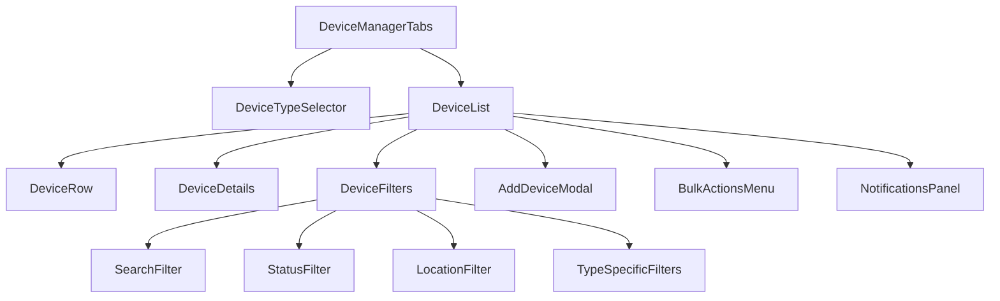
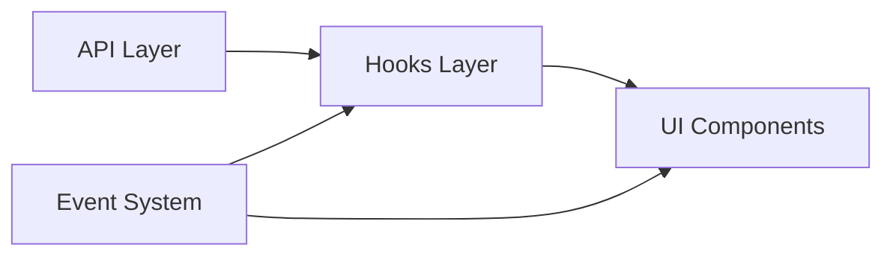

# Device Manager Redesign Plan

## Overview

This document outlines the plan for reconstructing the Device Manager component from scratch, addressing the identified issues in the current implementation:

- Hard-coded values throughout the components
- Redundant type definitions across files
- Mock implementations instead of real API calls
- Inefficient data handling

The new implementation will provide:

- Unified type definitions matching the Prisma schema
- Consistent data fetching with custom hooks
- Real API integration for all device actions
- Improved visual design and user experience
- Proper state management and error handling

## Architecture

### Component Structure



### Data Flow Architecture



## Shared Type Definitions

We'll create a new set of TypeScript interfaces that properly model the device data structure from the Prisma schema:

```typescript
// types/devices.ts

export type DeviceType = 'BUTTON' | 'SMART_WATCH' | 'REPEATER' | 'SENSOR' | 'CONTROL';

export interface BaseDevice {
  id: number;
  uid: string;
  name: string | null;
  room: string;
  type: DeviceType;
  battery: number;
  signal: number;
  isActive: boolean;
  lastSeen: string;
  firmwareVersion?: string;
  location?: string;
  createdAt: string;
  updatedAt: string;
}

export interface ButtonDevice extends BaseDevice {
  type: 'BUTTON';
  // Button-specific fields
}

export interface SmartWatchDevice extends BaseDevice {
  type: 'SMART_WATCH';
  model?: string;
  assignedToUserId?: number;
  lastSync?: string;
}

export interface RepeaterDevice extends BaseDevice {
  type: 'REPEATER';
  connectionType?: 'Ethernet' | 'Wi-Fi';
  operatingFrequency?: string;
  isEmergencyMode?: boolean;
  connectedDevices?: number;
  coverageArea?: string;
  meshRole?: 'primary' | 'secondary' | 'standalone';
  ipAddress?: string;
  macAddress?: string;
}

// Type guard functions to ensure type safety
export function isButtonDevice(device: BaseDevice): device is ButtonDevice {
  return device.type === 'BUTTON';
}

export function isSmartWatchDevice(device: BaseDevice): device is SmartWatchDevice {
  return device.type === 'SMART_WATCH';
}

export function isRepeaterDevice(device: BaseDevice): device is RepeaterDevice {
  return device.type === 'REPEATER';
}
```

## Custom Hooks

We'll create unified hooks for data fetching and state management:

### useDevices Hook

```typescript
// hooks/useDevices.ts

export interface DeviceFilters {
  search?: string;
  type?: DeviceType;
  isActive?: boolean;
  isEmergencyMode?: boolean;
  location?: string;
  connectionType?: string;
  page?: number;
  limit?: number;
  sort?: string;
}

export function useDevices(filters: DeviceFilters) {
  const [devices, setDevices] = useState<BaseDevice[]>([]);
  const [loading, setLoading] = useState(true);
  const [error, setError] = useState<Error | null>(null);
  const [meta, setMeta] = useState({
    page: 1,
    limit: 10,
    total: 0,
    totalPages: 0
  });

  useEffect(() => {
    const fetchDevices = async () => {
      setLoading(true);
      try {
        const params = new URLSearchParams();
        
        // Add all filters to query params
        if (filters.search) params.append('search', filters.search);
        if (filters.type) params.append('type', filters.type);
        if (filters.isActive !== undefined) params.append('isActive', String(filters.isActive));
        if (filters.isEmergencyMode !== undefined) params.append('isEmergencyMode', String(filters.isEmergencyMode));
        if (filters.location) params.append('location', filters.location);
        if (filters.connectionType) params.append('connectionType', filters.connectionType);
        
        // Pagination
        params.append('page', String(filters.page || 1));
        params.append('limit', String(filters.limit || 10));
        
        const response = await fetch(`/api/devices?${params}`);
        if (!response.ok) throw new Error('Failed to fetch devices');
        
        const data = await response.json();
        setDevices(data.devices);
        setMeta(data.meta);
      } catch (err) {
        setError(err instanceof Error ? err : new Error('An unknown error occurred'));
      } finally {
        setLoading(false);
      }
    };
    
    fetchDevices();
  }, [filters]);

  return { devices, loading, error, meta };
}
```

### useDeviceActions Hook

```typescript
// hooks/useDeviceActions.ts

export function useDeviceActions() {
  const [actionStatus, setActionStatus] = useState<{
    loading: boolean;
    success: boolean | null;
    error: Error | null;
  }>({
    loading: false,
    success: null,
    error: null
  });

  // Toggle device active state
  const toggleDeviceActive = async (deviceId: number, isActive: boolean) => {
    setActionStatus({ loading: true, success: null, error: null });
    try {
      const response = await fetch(`/api/devices/${deviceId}`, {
        method: 'PUT',
        headers: { 'Content-Type': 'application/json' },
        body: JSON.stringify({ isActive: !isActive })
      });
      
      if (!response.ok) throw new Error('Failed to update device');
      
      setActionStatus({ loading: false, success: true, error: null });
      return await response.json();
    } catch (err) {
      setActionStatus({
        loading: false,
        success: false,
        error: err instanceof Error ? err : new Error('An unknown error occurred')
      });
      throw err;
    }
  };

  // Other device actions: updateFirmware, toggleEmergencyMode, etc.
  // ...

  return {
    actionStatus,
    toggleDeviceActive,
    // other actions
  };
}
```

### useDeviceUpdateEvents Hook (Improved)

```typescript
// hooks/useDeviceUpdateEvents.ts

export function useDeviceUpdateEvents(callback: (data: any) => void) {
  const [connected, setConnected] = useState(false);
  
  useEffect(() => {
    const eventSource = new EventSource('/api/events/stream');
    
    eventSource.onopen = () => {
      setConnected(true);
    };
    
    eventSource.onmessage = (event) => {
      try {
        const data = JSON.parse(event.data);
        if (data.event === 'DEVICE_UPDATED') {
          callback(data.payload);
        }
      } catch (error) {
        console.error('Error parsing SSE event:', error);
      }
    };
    
    eventSource.onerror = () => {
      setConnected(false);
      // Implement reconnection logic
      // ...
    };
    
    return () => {
      eventSource.close();
    };
  }, [callback]);
  
  return { connected };
}
```

## Component Implementation

### 1. DeviceManagerTabs (Main Container)

This will be the entry point for the Device Manager, providing the tab navigation between device types.

```typescript
// components/device-manager/device-manager-tabs.tsx

export function DeviceManagerTabs() {
  return (
    <Tabs defaultValue="buttons">
      <TabsList>
        <TabsTrigger value="buttons">Buttons</TabsTrigger>
        <TabsTrigger value="smartwatches">Smart Watches</TabsTrigger>
        <TabsTrigger value="repeaters">Repeaters</TabsTrigger>
        <TabsTrigger value="server">Server</TabsTrigger>
      </TabsList>
      
      <TabsContent value="buttons">
        <DeviceList type="BUTTON" />
      </TabsContent>
      
      <TabsContent value="smartwatches">
        <DeviceList type="SMART_WATCH" />
      </TabsContent>
      
      <TabsContent value="repeaters">
        <DeviceList type="REPEATER" />
      </TabsContent>
      
      <TabsContent value="server">
        <ServerContent />
      </TabsContent>
    </Tabs>
  );
}
```

### 2. DeviceList (Unified List Component)

This will be a unified component for listing devices of any type, with type-specific rendering.

```typescript
// components/device-manager/device-list.tsx

interface DeviceListProps {
  type: DeviceType;
}

export function DeviceList({ type }: DeviceListProps) {
  // State for filters, search, etc.
  const [filters, setFilters] = useState<DeviceFilters>({
    type,
    page: 1,
    limit: 10
  });
  
  // Custom hook for fetching devices
  const { devices, loading, error, meta } = useDevices(filters);
  
  // Get available filter options from the devices
  const locations = useMemo(() => {
    return Array.from(new Set(devices.map(device => device.location).filter(Boolean)));
  }, [devices]);
  
  // Handle real-time updates
  useDeviceUpdateEvents((data) => {
    // Update device in the list when events are received
  });
  
  return (
    <div className="space-y-6">
      <DeviceListHeader 
        type={type} 
        onSearch={(term) => setFilters(prev => ({ ...prev, search: term }))} 
      />
      
      <DeviceFilterBar 
        filters={filters}
        onFilterChange={setFilters}
        availableLocations={locations}
      />
      
      <div className="rounded-md border">
        <Table>
          <TableHeader>
            <TableRow>
              <TableHead>Device</TableHead>
              <TableHead>Status</TableHead>
              {/* Type-specific headers */}
              {type === 'REPEATER' && (
                <>
                  <TableHead>Connection</TableHead>
                  <TableHead>Location</TableHead>
                  <TableHead className="text-center">Devices</TableHead>
                  <TableHead>Frequency</TableHead>
                </>
              )}
              {type === 'SMART_WATCH' && (
                <>
                  <TableHead>Model</TableHead>
                  <TableHead>Assigned To</TableHead>
                  <TableHead>Last Sync</TableHead>
                </>
              )}
              {/* Common headers */}
              <TableHead className="text-center">Battery</TableHead>
              <TableHead className="text-center">Signal</TableHead>
              <TableHead>Last Seen</TableHead>
              <TableHead className="text-right">Actions</TableHead>
            </TableRow>
          </TableHeader>
          
          <TableBody>
            {loading ? (
              <DeviceListSkeleton columns={getColumnCount(type)} rows={5} />
            ) : devices.length === 0 ? (
              <DeviceListEmpty type={type} hasFilters={hasActiveFilters(filters)} />
            ) : (
              devices.map((device) => (
                <DeviceRow 
                  key={device.id} 
                  device={device} 
                  onViewDetails={() => handleViewDetails(device)} 
                />
              ))
            )}
          </TableBody>
          
          {devices.length > 0 && (
            <TableCaption>
              <DeviceListPagination 
                currentPage={meta.page}
                totalPages={meta.totalPages}
                onPageChange={(page) => setFilters(prev => ({ ...prev, page }))}
              />
            </TableCaption>
          )}
        </Table>
      </div>
    </div>
  );
}
```

### 3. DeviceRow (Unified Row Component)

A unified component for rendering device rows, with type-specific displays.

```typescript
// components/device-manager/device-row.tsx

interface DeviceRowProps {
  device: BaseDevice;
  onViewDetails: () => void;
}

export function DeviceRow({ device, onViewDetails }: DeviceRowProps) {
  const { actionStatus, toggleDeviceActive } = useDeviceActions();
  const formatTimeAgo = (timestamp: string) => formatDistanceToNow(new Date(timestamp), { addSuffix: true });
  const lastSeenFormatted = formatTimeAgo(device.lastSeen);
  
  return (
    <TableRow>
      <TableCell className="font-medium">
        <div>
          <p className="font-medium">{device.name}</p>
          <p className="text-xs text-muted-foreground font-mono">{device.uid}</p>
        </div>
      </TableCell>
      
      <TableCell>
        <DeviceStatusBadge device={device} />
      </TableCell>
      
      {/* Type-specific cells */}
      {isRepeaterDevice(device) && (
        <>
          <TableCell>
            <RepeaterConnectionCell connectionType={device.connectionType} />
          </TableCell>
          <TableCell>{device.location || device.room}</TableCell>
          <TableCell className="text-center">
            <Badge variant={device.connectedDevices ? "secondary" : "outline"}>
              {device.connectedDevices || 0}
            </Badge>
          </TableCell>
          <TableCell>
            <span className="text-xs font-mono">{device.operatingFrequency || 'N/A'}</span>
          </TableCell>
        </>
      )}
      
      {isSmartWatchDevice(device) && (
        <>
          <TableCell>{device.model || 'Standard'}</TableCell>
          <TableCell>{device.assignedToUserId ? 'Assigned' : 'Unassigned'}</TableCell>
          <TableCell>{device.lastSync ? formatTimeAgo(device.lastSync) : 'Never'}</TableCell>
        </>
      )}
      
      {/* Common cells */}
      <TableCell className="text-center">
        <div className="flex justify-center">
          <BatteryIndicator value={device.battery} />
        </div>
      </TableCell>
      
      <TableCell className="text-center">
        <div className="flex justify-center">
          <SignalIndicator value={device.signal} />
        </div>
      </TableCell>
      
      <TableCell className="text-sm text-muted-foreground">
        {lastSeenFormatted}
      </TableCell>
      
      <TableCell className="text-right">
        <DeviceActions 
          device={device} 
          onViewDetails={onViewDetails}
          onToggleActive={() => toggleDeviceActive(device.id, device.isActive)}
          isLoading={actionStatus.loading}
        />
      </TableCell>
    </TableRow>
  );
}
```

### 4. Common Components

We'll create several reusable components to ensure consistency:

- `DeviceStatusBadge` - Display device status with appropriate styling
- `DeviceActions` - Dropdown menu for device actions 
- `DeviceFilterBar` - Filter controls for all device lists
- `DeviceDetails` - Modal or drawer for device details
- `AddDeviceModal` - Form for adding new devices
- `EditDeviceModal` - Form for editing device details
- `BulkActionsMenu` - Menu for actions that affect multiple devices

## Visual Design Improvements

1. **Consistent Card Design**
   - Use a clean, shadow card design for all device lists and details
   - Maintain consistent spacing and padding throughout

2. **Status Indicators**
   - Improve visual hierarchy with clear status indicators
   - Use consistent color coding for device states

3. **Responsive Layout**
   - Implement responsive design for all device manager components
   - Target mobile, tablet, and desktop viewport sizes

4. **Loading States**
   - Add skeleton loaders for improved loading experience
   - Add transition animations for smoother state changes

5. **Filter/Sort UI**
   - Redesign filter interface for better usability
   - Add visual indicators for active filters

## Implementation Plan & Timeline

### Phase 1: Core Infrastructure (3 days)
- Create shared type definitions
- Implement data fetching hooks
- Set up base layout components

### Phase 2: Unified Components (3 days)
- Create unified device list components
- Implement common UI elements
- Build action handlers for CRUD operations

### Phase 3: Device Type Implementations (4 days)
- Implement repeater-specific components
- Implement button-specific components
- Implement smart-watch-specific components

### Phase 4: Detail Views & Modals (3 days)
- Implement device details views
- Create add/edit device forms
- Build bulk action interfaces

### Phase 5: Testing & Refinement (2 days)
- End-to-end testing
- Performance optimization
- Visual polish

## Key Considerations

1. **Error Handling**
   - All API calls should handle errors gracefully
   - Provide useful feedback to users when operations fail

2. **Loading States**
   - Display appropriate loading indicators for all async operations
   - Prevent UI flicker during updates

3. **Type Safety**
   - Use TypeScript consistently to ensure type safety
   - Implement type guards for device-specific operations

4. **Real-time Updates**
   - Use SSE for live updates from the server
   - Gracefully handle connection issues

5. **Accessibility**
   - Ensure all components meet WCAG standards
   - Implement keyboard navigation and screen reader support